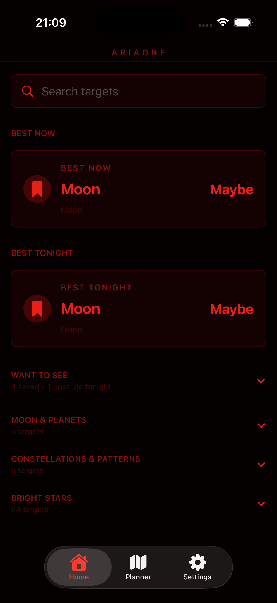
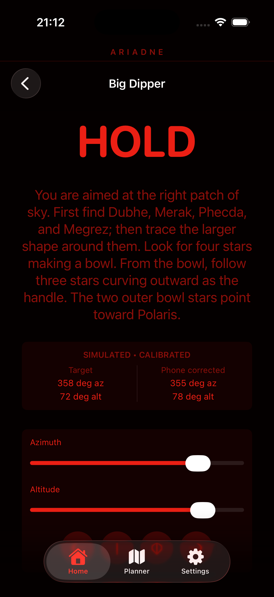
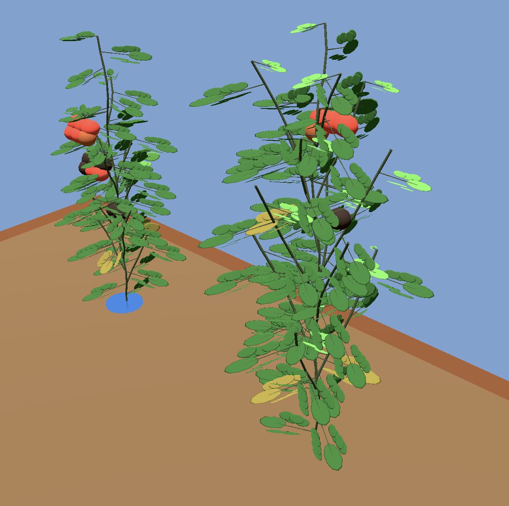
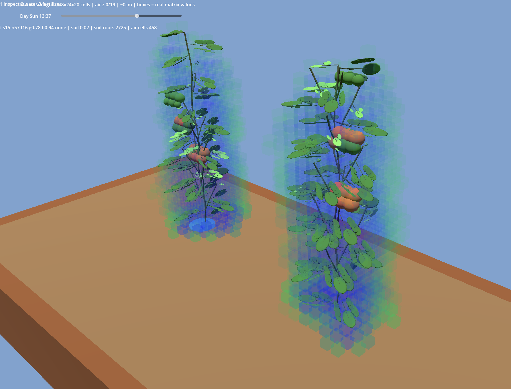
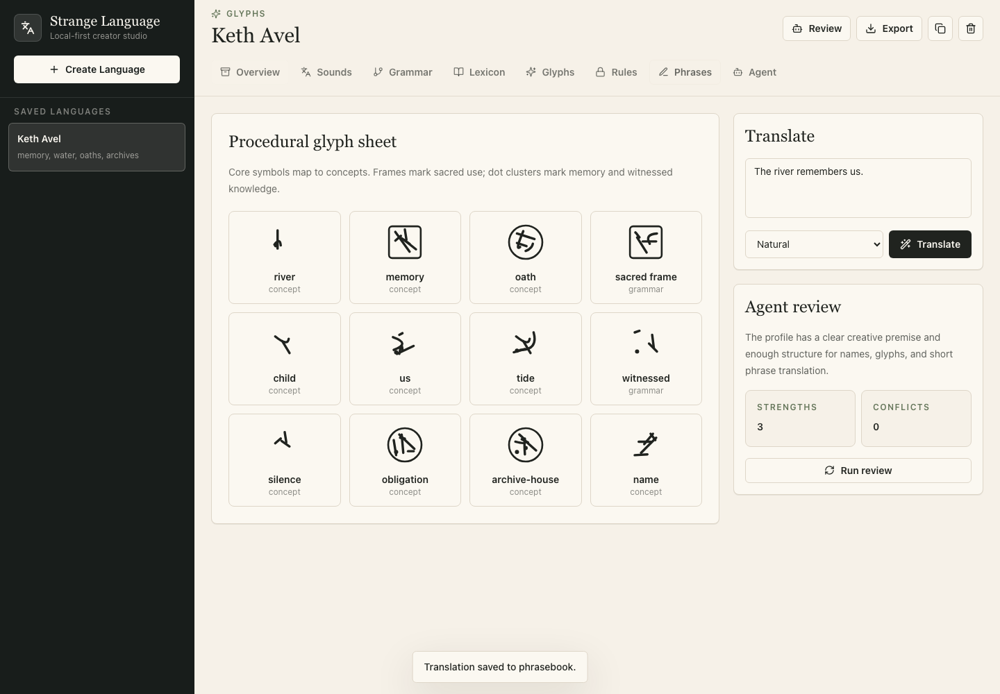
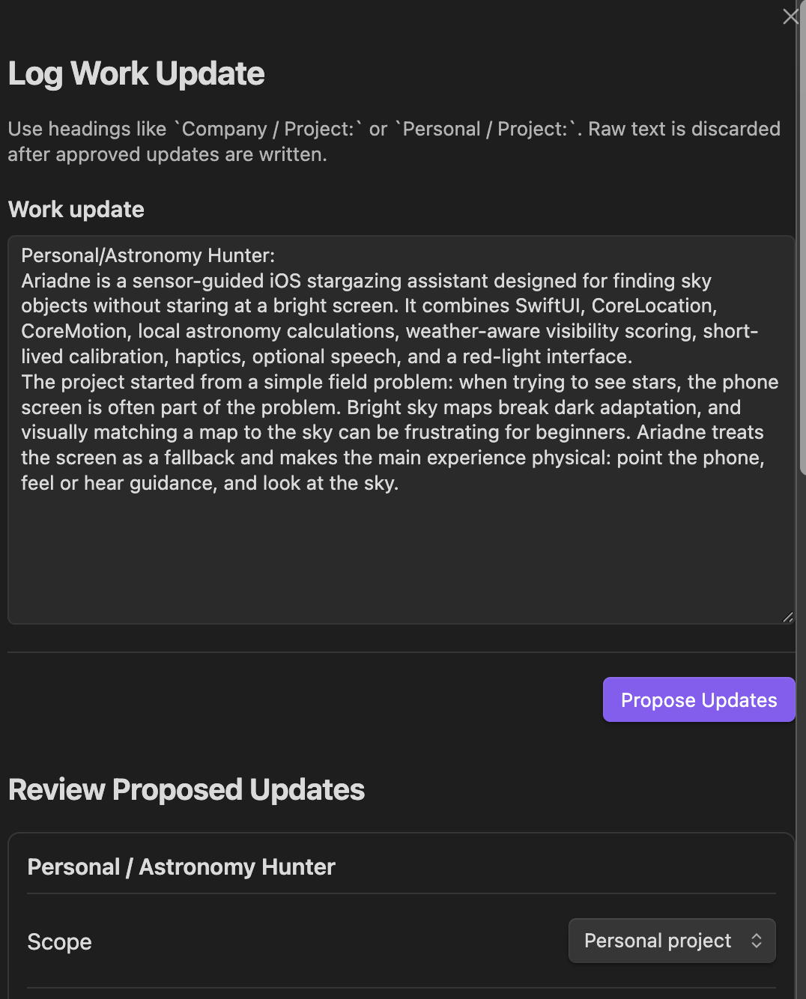
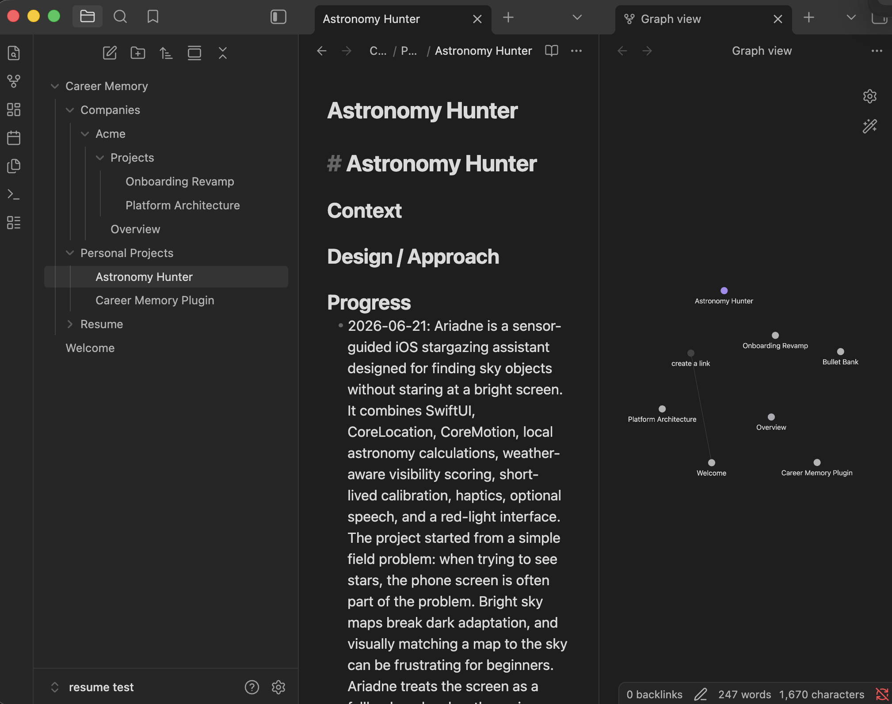
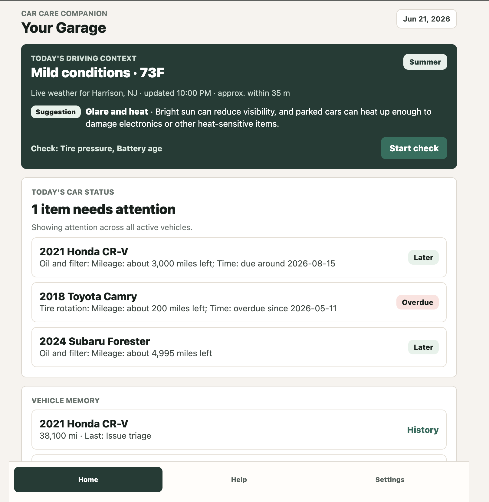
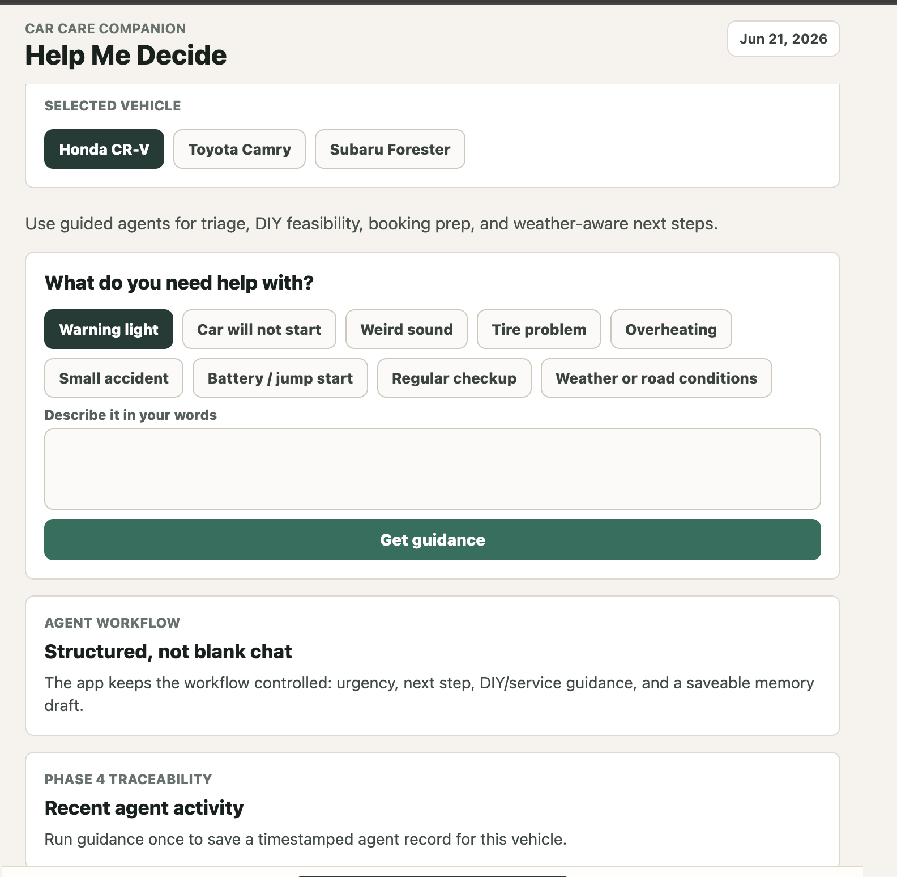

# Hi, I'm Qianqian

I build thoughtful product prototypes and software tools, especially projects that connect software with real-world context.

Most of the work here is still private or in progress. I use these projects to practice product engineering, system design, and calm interfaces around everyday problems.

## Selected Prototypes

<!-- portfolio-projects:start -->
### Ariadne / Astronomy Hunt

A darkness-first iOS stargazing assistant for finding stars, planets, the Moon, and sky patterns without staring at a bright screen.

Ariadne acts as a quiet pointing coach for one target at a time, combining local sky calculations, red-light UI, haptics, optional speech, and recognition prompts for eyes-up observing.

**Tech stack:** SwiftUI, CoreLocation, CoreMotion, local astronomy calculations, Open-Meteo weather, haptics, offline target catalog.

**Status:** Indoor prototype complete; outdoor validation still needed.

**Latest progress (2026-06-21):** Indoor-testable hunt flow. Built Home, target detail, planner, calibration, hunt guidance, recognition prompts, and found-state flows that can be exercised with simulated pointing before a clear-night validation pass.

  
  

### Garden Companion

A Godot prototype for a botanically grounded garden simulation.

The current tomato vertical slice grows plants from a tree of roots, stems, nodes, compound leaves, flower trusses, and fruit while a raised bed stores soil and air as 3D matrices for water, nutrients, sunlight, airflow, and disease pressure.

**Tech stack:** Godot 4, GDScript, JSON plant and plot data, custom plant-tree simulation, 3D soil and air matrices, headless Godot tests.

**Status:** Developer-playable simulation prototype; final game loop and visual polish are still in progress.

**Latest progress (2026-06-21):** Tomato vertical slice with matrix debug views. Built procedural tomato growth, local watering and fertilizing, resource-limited growth, weather controls, and 3D matrix debug views for sunlight and soil actions.

  
  

### Strange Language Studio

A local-first creative tool for designing fictional languages for writing, worldbuilding, games, and art projects.

Phase 1 lets creators make saved language profiles, inspect generated glyphs and lexicon entries, run lightweight agent review, translate short phrases, save phrasebook entries, and export portable JSON, Markdown, and SVG artifacts.

**Tech stack:** React, TypeScript, Vite, localStorage, procedural SVG glyphs, mock and optional OpenAI-backed agent flows, JSON/Markdown/SVG exports.

**Status:** Phase 1 vertical slice; build and lint pass, with deeper linguistics and production AI plumbing planned later.

**Latest progress (2026-06-21):** Phase 1 studio workflow. Built the first portfolio-ready workflow: guided language creation, saved profiles, editable lexicon entries, glyph previews, phrase translation, phrasebook management, agent review, and export options.

  

### Career Memory for Obsidian

A local-first Obsidian plugin prototype for turning natural-language work updates into structured career memory and resume bullet candidates.

Career Memory explores a human-in-the-loop AI workflow where the model proposes structured memory updates, Zod validates them, the user reviews them, and deterministic writers persist approved changes to local Markdown files.

**Tech stack:** TypeScript, Obsidian Plugin API, Markdown persistence, Zod, mock/OpenAI/Anthropic provider adapters, local job-description matching.

**Status:** Early private prototype; mock workflow works, but UI polish, tests, and real-provider QA are still pending.

**Latest progress (2026-06-21):** Local review-to-Markdown workflow. Built the core loop for logging work updates, reviewing proposed company/project memory changes, writing approved Markdown files, and collecting evaluated resume bullet candidates.

  
  

### Car Care Companion

An Expo / React Native prototype for everyday car ownership support.

The prototype explores vehicle memory, service history, maintenance reminders, monthly checks, mechanic-prep summaries, weather-aware driving context, and structured help flows for unsure drivers.

**Tech stack:** Expo, React Native, TypeScript, Supabase schema planning, weather context, agent workflow planning.

**Status:** Product prototype and planning work; useful app foundations are in place, but the assistant layer and production polish are not finished.

**Latest progress (2026-06-21):** Garage dashboard and help flow foundation. Built the app foundation around vehicle memory, maintenance status, weather-aware context, and a structured Help Me Decide flow for car-care questions.

  
  

<!-- portfolio-projects:end -->

## Interests

Mobile apps, product engineering, practical tools, calm interfaces, and software that handles messy real-world constraints.
